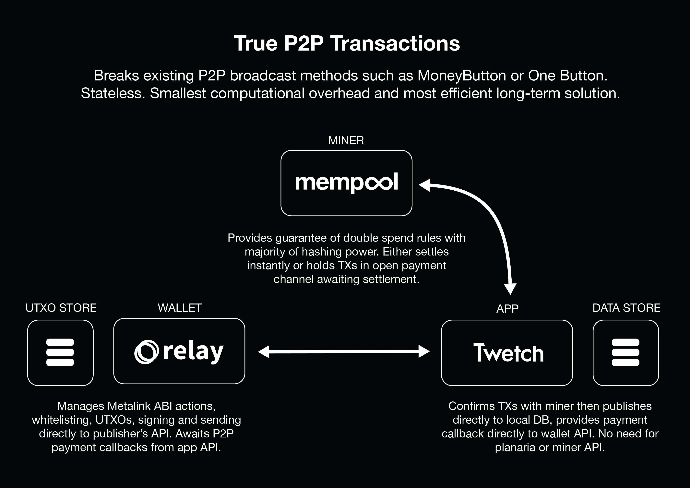

# Unplanaria
Unplanaria is designed to solve the problems Planaria solves in a way that is:

- More scalable
- Less resource-intensive
- Doesn't require spamming the p2p broadcast network with requests
- Doesn't require digging through 99% weather data for the <1% of transactions you are interested in

While it works for now, the problem with spamming from the p2p network is that the burden it places on the p2p broadcast network is the number of transactions (tx) to the power of the number of nodes `n`, or `tx^n`. This is fine when the network isn't under heavy load, but it probably won't work too well with gigabytes of data.

I propose a different solution. Let's send raw TXs directly to the apps that are consuming them, allow them to scrape the data from the outputs to store locally, and then broadcast them themselves, like so:

In this solution, wallets will be able to sign and send raw TXs directly to the apps that are consuming them. The apps can then filter these transactions, verify them, and decide whether or not they wish to broadcast them, and if so, at what point in the future they will do so. There are a few reasons this is a really great idea:

- Reduces OP_RETURN abuse.
- Gives apps the ability to moderate content, or not, up to you!
- Empowers apps to develop relationships with miners, negotiate better fees and utilise payment channels which are much faster than p2p broadcast. 
- It greatly reduces the strain on the p2p broadcast network. 
- In the future, miners will also be able to check with the majority of hashing power via Miner ID to ensure there will be no double spends, giving us secure zero-conf without even having to mine the transactions.
- It realises the concept of true peer-to-peer transactions.
- Allows the sending of *unsigned* transactions that the app itself can hold and perhaps later publish. Consider something like a pull request in a git repo!
- Lets you add extra content to transactions such as a unique ID or a date so you can sync transactions back in the order they occurred.

There are many other great use cases. This is still a work in progress, and I would greatly appreciate your feedback if you think this might be a useful idea for your business or project.